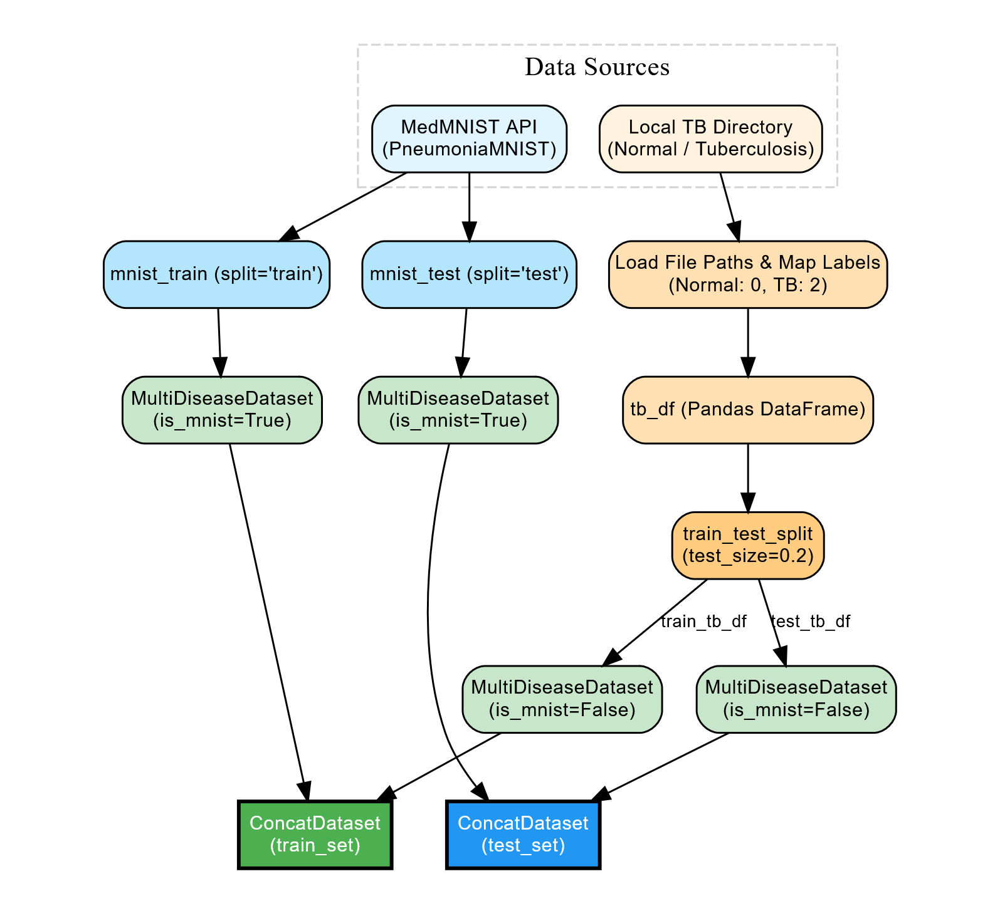
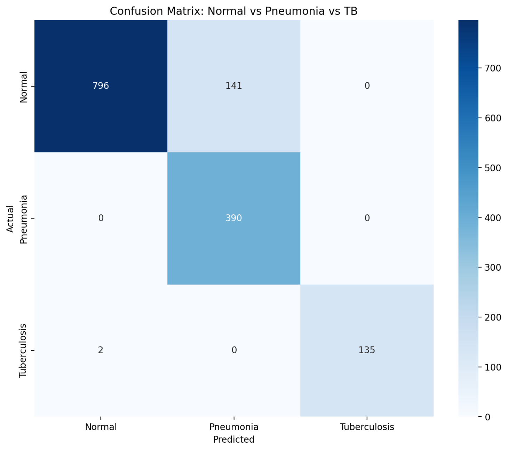
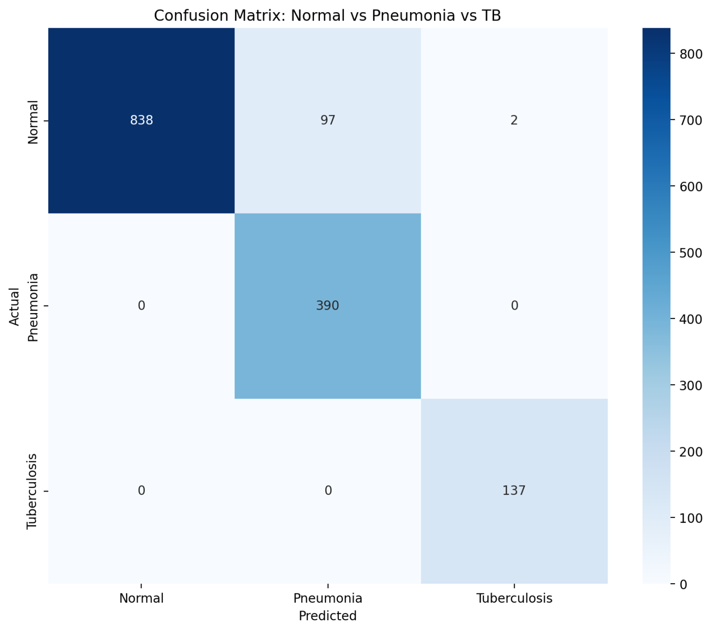

# Classification of Chest X-Ray images: Pneumonia, Turberculosis and Normal 


## Get Started
1. Install the required packages
    ```bash
    pip install -r requirements.txt
    ```

2. Start the system
    ```bash
    streamlit run app.py
    ```


## Configuration
Nvidia GeForce RTX 4060 (8GB)


## Dataset
| Dataset | Samples | Classes |
|-|-|-|
| [PneumoniaMNIST](https://github.com/Hlunlun/MedMNIST-Classification) | 5,856 | 2 |
|Tuberculosis Chest X-Ray Images | 4200 | 2 |

### Preprocessing


## Model
|Backbone|ACC|
|-|-|
|[ResNet50](https://arxiv.org/abs/1512.03385)|0.94|
|[EfficientNet-B0](https://arxiv.org/abs/1905.11946)|0.90|
|[ConvNeXt-Tiny](https://arxiv.org/abs/2201.03545)|0.93|
|[Vision Transformer](https://arxiv.org/abs/2010.11929)|0.93|

### RestNet50:
- Performance on every class
  |precision|recall|f1-score|support|
  |-|-|-|-|
  |Normal|1.00|0.90|0.954|937|
  |Pneumonia|0.81|1.00|0.90|390|
  |Tuberculosis|1.00|0.98|0.99|137|
- Overall Performance
  |precision|recall|f1-score|support|
  |-|-|-|-|
  |micro avg|0.94|0.96|0.94|1464|
  |weighted avg|0.95|0.94|0.94|1464|

### EfficientNet-B0
- Performance on every class
  ||precision|recall|f1-score|support|
  |-|-|-|-|-|
  |Normal|1.00|0.85|0.92|937|
  |Pneumonia|0.73|1.00|0.85|390|
  |Tuberculosis|1.00|0.99|0.99|137|
- Overall Performance
  ||precision|recall|f1-score|support|
  |-|-|-|-|-|
  |macro avg|0.91|0.94|0.92|1464|
  |weighted avg|0.93|0.90|0.91|1464|

### ConvNeXt-Tiny
- Performance on every class
  ||precision|recall|f1-score|support|
  |-|-|-|-|-|
  |Normal|1.00|0.89|0.94|937|
  |Pneumonia|0.80|1.00|0.89|390|
  |Tuberculosis|0.99|1.00|0.99|137|
- Overall Performance
  ||precision|recall|f1-score|support|
  |-|-|-|-|-|
  |macro avg|0.93|0.96|0.94|1464|
  |weighted avg|0.95|0.93|0.93|1464|
  

### Vision Transformer
- Performance on every class
  ||precision|recall|f1-score|support|
  |-|-|-|-|-|
  |Normal|0.98|0.92|0.95|937|
  |Pneumonia|0.83|0.98|0.90|390|
  |Tuberculosis|1.00|0.88|0.94|137|

- Overall Performance
  ||precision|recall|f1-score|support|
  |-|-|-|-|-|
  |macro avg|0.9430.95|0.93|1464|
  |weighted avg|0.94|0.93|0.93|1464|


## Training Scripts
You can compare different model using the training scripts in [JupyterNotebook/](https://github.com/Hlunlun/MedMNIST-Classification/tree/master/JupyterNotebook)

```bash
JupyterNotebook
  |-- main.ipynb
  |-- ensemble.ipynb
  |-- inference.ipynb
```

## Results
- ResNet50


- EfficientNet-B0


- ConvNeXt-Tiny


- Vision Transformer


