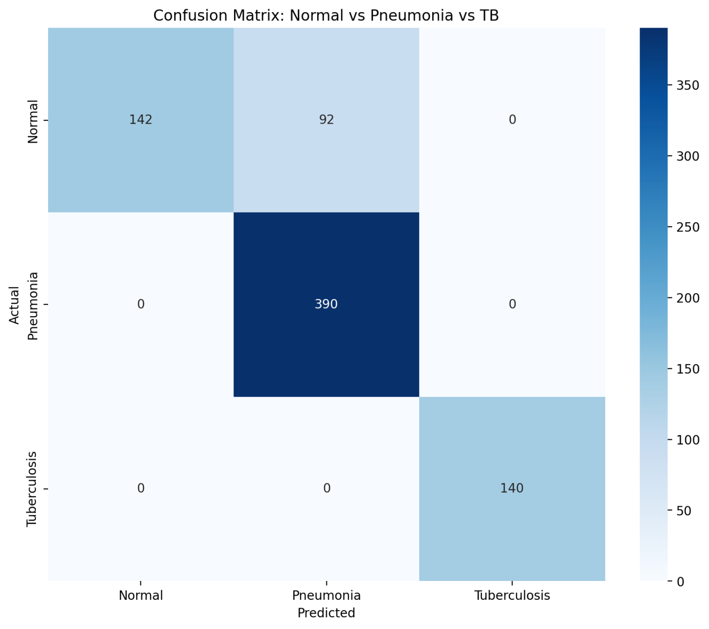

# Classification of Pneumonia, TB and Normal 

## Get Started
1. Install the required packages
    ```bash
    pip install -r requirements.txt
    ```

2. Start the system
    ```bash
    streamlit run app.py
    ```


## Dataset
The dataset is from [MedMNIST](https://github.com/med-mnist/medmnist) and is used for classification.

## Model
The model is from [ResNet50](https://pytorch.org/vision/0.15/models.html#classification) and is used for classification.

## Training Scripts
You can compare different model using the training scripts in [JupyterNotebook/](https://github.com/Hlunlun/MedMNIST-Classification/tree/master/JupyterNotebook)

```bash
JupyterNotebook
  |-- main.ipynb
  |-- ensemble.ipynb
  |-- inference.ipynb
```

## Results



